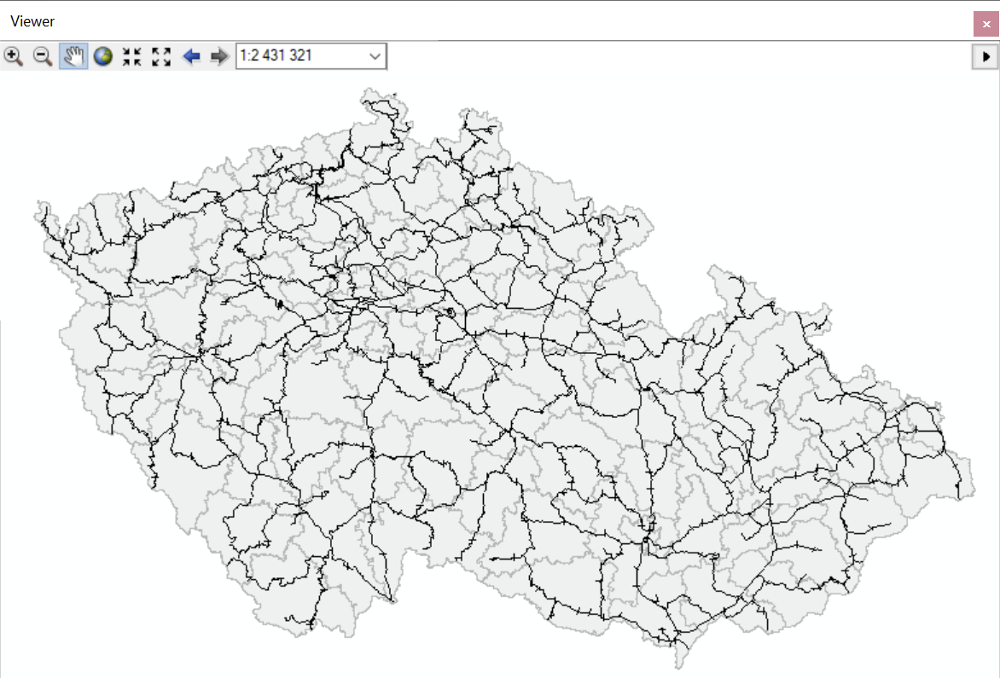
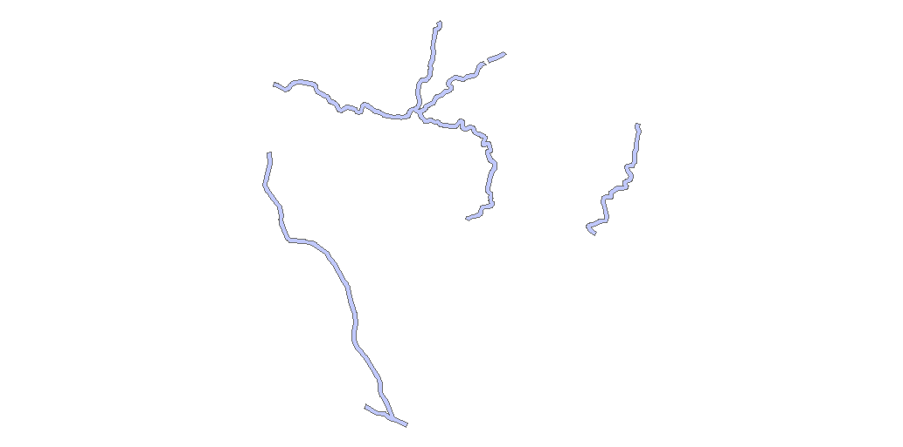
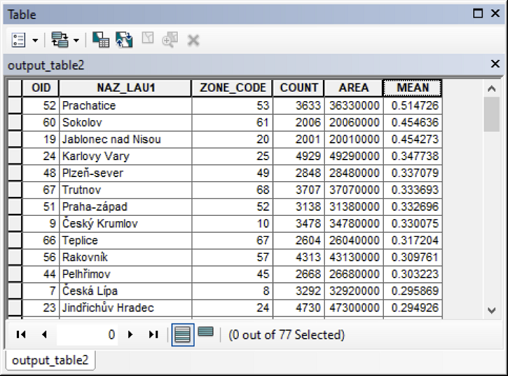
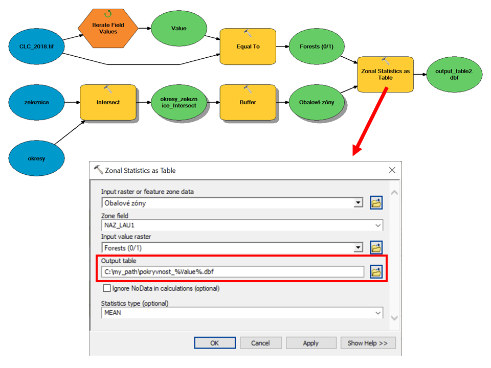
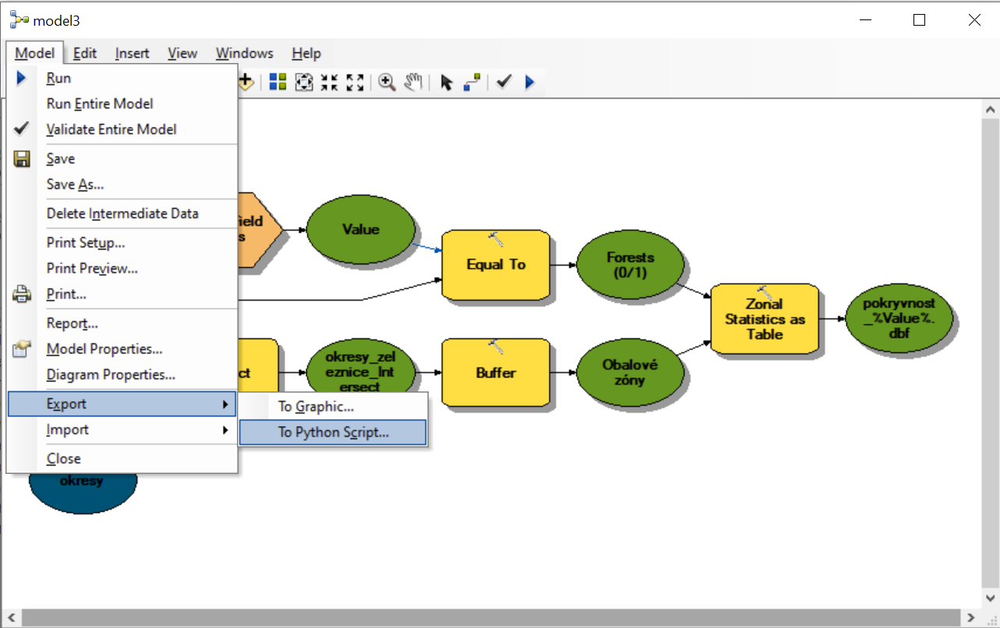

# Lekce 1: Grafické programování v aplikaci Model Builder

*(c) Vojtěch Barták, FŽP ČZU Praha, 2020/2021*

Tato lekce je zaměřena na prohloubení dovedností s automatizací prostorových úloh pomocí vestavěné aplikace systému ArcGIS *Model Builder*. Pomocí jednoduchého grafického řetězení nástrojů a vrstev nám tato aplikace zprostředkuje bezbolestný úvod do programátorského myšlení. Na lekci bezprostředně navazuje lekce 2, ve které se naučíte vytvořit ke svému modelu uživatelské rozhraní. V dalších lekcí pak již Model Builder používat nebudeme, neboť jej nahradíme mnohem mocnějším nástrojem: programovacím jazykem Python.

Lekce předpokládá znalost základů GIS a prostředí ArcGIS na úrovni předmětů GIS 1 a GIS 2, včetně základního ovládání aplikace Model Builder. (Pokud něco z uvedeného nesplňujete, nezoufejte, třeba zjistíte, že vám potřebné znalosti sami "dojdou".)

[TOC]

## Základní úloha

Chceme vědět, jaké je procentuální zastoupení lesů (či potažmo jiných tříd krajinného pokryvu) v pásmu 300 m kolem železničních tratí. Analýzu budeme provádět:

1. Pro pevně daný okres.
2. Pro všechny okresy.
3. Pro všechny okresy a všechny třídy krajinného pokryvu.

Výstup budeme chtít v podobě tabulky, ve které bude každému analyzovanému okresu odpovídat jeden řádek.

## Data

Budeme používat volně stažitelná data z následujících zdrojů: 

- [ArcČR 500](https://www.arcdata.cz/produkty/geograficka-data/arccr-500)
- [Corine Land Cover 2018](https://land.copernicus.eu/pan-european/corine-land-cover/lcc-2012-2018)

Z geodatabáze ArcČR 500 budeme potřebovat třídy prvků "Zeleznice" a "Okresy - polygony". Jsou v souřadnicovém systému S-JTSK Křovák East-North (EPSG: 5514).



Data [Corine Land Cover](https://land.copernicus.eu/pan-european/corine-land-cover/lcc-2012-2018) představují krajinný pokryv pro území Evropy v souřadnicovém systému ETRS 1989 LAEA (EPSG: 3035). Tato data jsou distribuována jak v rastrové (GeoTiff), tak ve vektorové (Esri File Geodatabase) podobě. My budeme pracovat s rastrem.


Než se pustíme do analýzy, je třeba:

- **Sjednotit souřadnicové systémy.** Vzhledem k tomu, že transformace vektorových dat je obecně snazší a méně "ztrátová" než transformace rastrových dat, převedeme vrstvy z ArcČR 500 do systému ETRS (nástroj *Project*).
- **Oříznout rastr krajinného pokryvu na území ČR.** Můžeme použít nástroj *Clip* (pozor: máme na mysli nástroj ze sady Data Management Tools -> Raster -> Raster Processing, nikoli stejnojmenný nástroj ze sady Analysis Tools -> Extract) a polygony okresů vzniklé transformací v předchozím kroku.
- **Reklasifikovat rastr krajinného pokryvu do základních kategorií**. Jak známo, krajinný pokryv Corine Land Cover je kódován třímístnými kódy, přičemž první číslice vyjadřuje základní kategorie, druhá číslice podrobnější členění a třetí číslice nejpodrobnější. My budeme pracovat se základními kategoriemi 1 - městské plochy, 2 - zemědělské plochy, 3 - lesy, 4 - mokřady a 5 - vodní plochy. Potřebujeme tedy rastr, který bude mít namísto třímístných kódů pouze těchto pět hodnot (nástroj *Reclassify*).

Pokud se nechcete stahováním a úpravou dat zabývat nebo nevíte, jak na to, můžete si připravená data stáhnout [zde](https://owncloud.cesnet.cz/index.php/s/oitTa20dvKXX65n).

## A. Řešení pro pevně daný okres

Řekněme, že chceme úlohu řešit pro okres Jindřichův Hradec. Možných řešení je více, jedno z nich může být toto:

1. Vybereme polygon okresu Jindřichův Hradec.
2. Vybraným polygonem ořízneme vrstvu železničních tratí.
3. Vytvoříme kolem tratí obalovou zónu (buffer) s poloměrem 300 m.
4. Pomocí zonální mapové algebry spočítáme (relativní) plochu lesů.

(Krok 4 působí trochu tajemně, podrobně si ho rozebereme později.)

Pokud bychom úlohu řešili spouštěním jednotlivých nástrojů, a nikoli pomocí modelu, pak bychom výběr okresu provedli ručně nástrojem *Select Features*. Při následném ořezávání nástrojem *Clip* by pak stačilo jako ořezovou vrstvu použít vrstvu okresů, v níž by byl proveden výběr. Jak výběr řešit v modelu?

Máme dvě možnosti. První spočívá v použití nástroje *Select* (ArcToolbox -> Analysis Tools -> Extract), který na danou vrstvu aplikuje atributový SQL dotaz a z vybraných prvků vytvoří novou datovou sadu.


Druhou možností je použití nástroje *Make Feature Layer* (ArcToolbox -> Data Management Tools -> Layers and Table Views). Ten ze vstupní datové sady nevytváří novou datovou sadu (jako tomu bylo u nástroje *Select*), ale pouze vrstvu. (Vrstva je dočasná reprezentace datové sady, která není uložena na pevný disk, ale existuje pouze v operační paměti počítače a po skončení běhu modelu je automaticky smazána. Lze ji v rámci modelu použít jako vstup do dalších nástrojů a může obsahovat výběr. Z jedné datové sady lze vytvořit libovolné množství vrstev, přičemž každá může obsahovat jiný výběr prvků.)

Podobně jako v nástroji *Select*, i v nástroji *Make Feature Layer* lze atributový výběr specifikovat pomocí parametru *Expression*, do něhož lze zapsat SQL dotaz:

 

Jelikož druhá z uvedených možností (nástroj *Make Feature Layer*) nevyžaduje zápis nových dat na pevný disk, dáme jí přirozeně přednost.

Oříznutí železničních tratí vybraným polygonem nástrojem *Clip* a tvorba obalové zóny 300 m nástrojem *Buffer* jsou triviální kroky, které nebudeme podrobně rozebírat. U nástroje *Buffer* však stojí za zmínku správné nastavení parametru *Dissolve Type*: jelikož chceme analýzu provést pro všechny úseky železniční trati dohromady, je třeba nastavit tento parametr na hodnotu "ALL". Vzniklé obalové zóny kolem jednotlivých úseků se tak spojí do jediného (multi)polygonu.


Pokud model spustíme (připomínáme, že je třeba jej nejprve uložit, a to nikoli do složky, ale do toolboxu), měli bychom obdržet zhruba toto (připomínáme, že výsledky z modelu je třeba přidat do ArcMap ručně):



> Ověřte, zda jste nastavili správně parametr *Dissolve Type* v nástroji *Buffer*. V atributové tabulce výsledné polygonové vrstvy byste měli vidět pouze jeden řádek.

Nyní zbývá poslední krok, "pomocí zonální mapové algebry spočítat relativní plochu lesů". Uvedené formulaci může opět odpovídat více možných řešení. Ukážeme si jedno, které je efektivní obzvlášť tehdy, chceme-li spočítat *relativní* plochu (tj. procento plochy vztažené k celkové ploše, zde procento plochy lesů vzhledem k celkové ploše obalové zóny). Spočívá ve dvou krocích:

1. Vytvoříme logický rastr (tj. rastr s hodnotami 0/1) reprezentující lesy (1 ... les, 0 ... ostatní). 
2. Nástrojem *Zonal Statistics as Table* (ArcToolbox -> Spatial Analyst -> Zonal) spočítáme v obalové zóně průměr z výše uvedeného rastru. (Uvědomte si, že průměrem z nul a jedniček v obalové zóně dostaneme relativní zastoupení jedniček, tj. vlastně relativní plochu lesů, na škále 0, 1. Relativní plochu v procentech pak dostaneme jednoduše vynásobením stem.)

První z uvedených kroků můžeme realizovat např. reklasifikací (ArcToolbox -> Spatial Analyst -> Reclass -> *Reclassify*) nebo nástrojem *Equal To* (ArcToolbox -> Spatial Analyst -> Math -> Logical). Druhá možnost je jednodušší, proto ji použijeme. Lesy jsou v rastru krajinného pokryvu reprezentovány hodnotou 3, proto bude rastr nástrojem *Equal To* porovnán právě s hodnotou 3:


Výsledný model tedy bude vypadat následovně:


Po uložení a spuštění modelu obdržíme výslednou DBF tabulku, z které plyne, že procentuální zastoupení lesů v pásmu 300 m kolem železnic je v okrese Jindřichův Hradec cca 30%:


## B. Řešení pro všechny okresy

Pokud chceme stejnou úlohu řešit pro všechny okresy, odpadne nutnost na začátku vybírat okres nástrojem *Make Feature Layer* a ořezávat jím železniční tratě. Abychom nicméně rozlišili, které části tratí patří do kterých okresů, musíme spočítat průnik obou vrstev nástrojem *Intersect*. Výsledná vrstva bude obsahovat úseky tratí "rozřezané" hranicemi okresů a v atributech těchto úseků bude i informace, do kterého okresu který úsek patří. 

Pokud následně v nástroji *Buffer* nastavíme parametr *Dissolve Type* jako "LIST" a v seznamu polí *Dissolve Fields* zaškrtneme pole s názvy okresů ("NAZ_LAU1"), bude výsledkem jeden (multi)polygon pro každý okres. Vrstvu těchto polygonů (obalových zón) pak použijeme jako *Input Zone Data* v nástroji *Zonal Statistics As Table*. 

Výsledný model:


a výsledek:



Ihned vidíme, že nejvyšší zastoupení lesů kolem tratí má (nepřekvapivě) okres Prachatice, a to 51%.

## C. Řešení s iterací přes třídy krajinného pokryvu

Pokud budeme chtít naši analýzu provést pro všechny třídy krajinného pokryvu, máme dvě možnosti:

- použít řešení B v cyklu přes jednotlivé třídy krajinného pokryvu,
- upravit řešení B tak, aby se analýza provedla pro všechny třídy krajinného pokryvu naráz.

Druhé řešení je bezesporu efektivnější (viz [úlohu 1](#úlohy]) na konci lekce), např. proto, že při něm není třeba v každém kole cyklu znovu provádět průnik a vytvářet obalovou zónu. Jelikož naším cílem je však ukázat si použití iterátoru v modelu, přikloníme se zde k prvnímu způsobu. Výhodou je, že vyžaduje jen malou úpravu modelu vytvořeného při řešení B.

Abychom nějakou proceduru nechali vykonávat opakovaně (tj. v cyklu), je třeba do modelu vložit tzv. *iterátor*. Protože chceme iterovat přes hodnoty diskrétního rastru, použijeme iterátor procházející hodnoty z daného pole atributové tabulky (Insert -> Iterators -> Field Value).

 

Na obrázku vidíte správné zapojení iterátoru do modelu. Iterátor má následující parametry:

- *Input Table*: vstupní tabulka, která se má v cyklu procházet. V našem případě jde o atributovou tabulku rastru Corine Land Cover, hodnotu parametru tedy nastavíme jako tento rastr. (Pravděpodobně jste toto provedli ručně propojením rastru a iterátoru šipkou.) 
- *Field*: pole, které chceme cyklicky procházet. V našem případě je to pole Value, obsahující přímo hodnoty rastru. 
- *Data Type*. Iterátor prochází dané pole řádek po řádku a v každém kole cyklu vrací na výstupu příslušnou hodnotu tohoto pole. Parametrem *Data Type* lze určit, v jakém datovém typu má tato hodnota na výstupu z iterátoru být. To závisí především na tom, co s ní dál v modelu chceme dělat. V našem případě bude výstupní hodnota z iterátoru použita do nástroje *Equal To* jako konstanta, s níž se má porovnat rastr Corine Land Cover. Odpovídajícím datovým typem bude tedy "Double" neboli číslo (u diskrétního rastru bychom mohli použít i "Long", tj. celé číslo).
- *Unique Values*. Pokud je toto políčko zaškrtnuté, procházejí se v daném poli pouze unikátní hodnoty (tj. žádná se neopakuje). Pokud zaškrtnuté není, prochází se celá tabulka řádek po řádku. My pochopitelně chceme procházet pouze unikátní hodnoty.
- *Skip Null Values*. Pokud bychom věděli, že pole obsahuje nějaké hodnoty, které se mají při procházení vynechat, zaškrtneme toto políčko a parametrem *Null Value* specifikujeme, o jaké hodnoty se jedná.

Pokud bychom takto model spustili, patrně by výpočet bez problémů proběhl, výsledkem by však byla pouze jedna tabulka odpovídající poslednímu procházenému krajinnému typu. To je proto, že v každém kole cyklu výpočet končí vytvořením tabulky nástrojem *Zonal Statistics as Table*, přičemž tato tabulka je stále stejně pojmenovaná. Pokud máme v ArcMap povolené přepisování již existujících datových sad, pak bude v každé iteraci vytvořena nová tabulka pro daný krajinný pokryv, jelikož však bude pojmenovaná stejně jako tabulka z předchozí iteraci, tuto předchozí tabulku prostě nahradí. (Pokud přepisování existujících dat povolené nemáte, pak bude výsledkem dokonce chybové hlášení.)

Jak z toho ven? Řešením je použít hodnotu, kterou v dané iteraci vrací iterátor, jako součást názvu výstupní tabulky. Pokud např. zvolíme jako strukturu názvu `<základ názvu>_<kód krajinného pokryvu>.dbf`, mohou se výstupní tabulky jmenovat např. `pokryvnost_1.dbf`, `pokryvnost_2.dbf` atd. 

Odkaz na nějakou proměnnou modelu (proměnnými v modelu jsou všechny entity reprezentované ovály) v názvu nějaké výstupní datové sady lze vytvořit pomocí znaku `%` před a za názvem proměnné. Princip bude zřejmý z příkladu na následujícím obrázku, kde je do názvu výstupní tabulky zakomponován název proměnné "Value", tedy proměnné reprezentující hodnotu, kterou vrací iterátor. Název tabulky je tedy zapsán jako `pokryvnost_%Value%.dbf`, přičemž v každém kole cyklu se část `%Value%` nahradí aktuální hodnotou proměnné Value.



Nyní nezbývá než model spustit a prohlédnout si výsledné tabulky.

(Pokud vás napadlo, že by bylo skvělé nemít výstup v pěti různých tabulkách, ale vytvořit jen jednu tabulku, ve které by jednotlivé krajinné typy byly ve sloupcích, podívejte se na úlohy 1 a 2 na konci lekce. Úloha 1 by v takový výstup měla přirozeně vyústit. Úloha 2 se oproti tomu může ukázat jako docela složitá. Ale nebojte,  pokud jí nezvládnete: až se naučíte místo sestavování modelů psát skripty v Pythonu, bude vše mnohem jednodušší!)

## Export modelu do Pythonu

Vytvořený model lze snadno exportovat do skriptu v Pythonu:



Tím se uloží soubor s koncovkou .py. Jde o obyčejný textový soubor, který po otevření např. v poznámkovém bloku vypadá takto:

```
# -*- coding: utf-8 -*-
# ---------------------------------------------------------------------------
# exported_model.py
# Created on: 2020-09-18 16:35:39.00000
#   (generated by ArcGIS/ModelBuilder)
# Description: 
# ---------------------------------------------------------------------------

# Import arcpy module
import arcpy

# Load required toolboxes
arcpy.ImportToolbox("Model Functions")


# Local variables:
okresy = "okresy"
zeleznice = "zeleznice"
okresy_zeleznice_Intersect = "C:\\Users\\vojta\\Documents\\ArcGIS\\Default.gdb\\okresy_Intersect"
Obalové_zóny = "C:\\Users\\vojta\\Documents\\ArcGIS\\Default.gdb\\okresy_Intersect_Buffer"
CLC_2018_tif = "CLC_2018.tif"
Value = CLC_2018_tif
Forests__0_1_ = "C:\\Users\\vojta\\Documents\\ArcGIS\\Default.gdb\\EqualTo_tif1"
pokryvnost__Value__dbf = "C:\\my_path\\pokryvnost_%Value%.dbf"

# Process: Intersect
arcpy.Intersect_analysis("okresy #;zeleznice #", okresy_zeleznice_Intersect, "ALL", "", "INPUT")

# Process: Buffer
arcpy.Buffer_analysis(okresy_zeleznice_Intersect, Obalové_zóny, "300 Meters", "RIGHT", "ROUND", "LIST", "NAZ_LAU1", "PLANAR")

# Process: Iterate Field Values
arcpy.IterateFieldValues_mb(CLC_2018_tif, "Value", "Double", "true", "false", "0")

# Process: Equal To
arcpy.gp.EqualTo_sa(CLC_2018_tif, Value, Forests__0_1_)

# Process: Zonal Statistics as Table
arcpy.gp.ZonalStatisticsAsTable_sa(Obalové_zóny, "NAZ_LAU1", Forests__0_1_, pokryvnost__Value__dbf, "NODATA", "MEAN")
```

Není cílem zde vysvětlovat vše, co je ve skriptu napsáno. Jde jen o letmou ukázku toho, co se v rámci tohoto kurzu naučíte psát sami. Tak s chutí do toho!

## Shrnutí

V této lekci jste si **zopakovali**: 

- několik vektorových (Clip, Buffer, Intersect) a několik rastrových (Equal To, Zonal Statistics as Table) analytických nástrojů, 

- jak se používá Model Builder ke zřetězení nástrojů při návrhu řešení komplexní úlohy. 

Nově jste se **naučili**:

- jak se v modelu provede výběr prvků, aniž byste museli vybrané prvky zapisovat do nové datové sady na disk (nástroj Make Feature Layer), 
- jak v modelu použít iterátor (s iterací přes hodnoty pole), 
- jak model exportovat do skriptu v Pythonu.

## Úlohy

1. Upravte řešení C tak, abyste se obešli bez iterátoru. (Nápověda: asi se vám bude hodit nástroj *Tabulate Area*.)
2. Upravte řešení C tak, aby výstupem byla pouze jedna tabulka, ve které budou jednotlivým třídám krajinného pokryvu odpovídat jednotlivé sloupce. Přitom však v modelu ponechte iterátor. (Nápověda: prozkoumejte nástroje v nástrojových sadách Data Management Tools -> Fields a Joins.)
3. Řešení A, B nebo C (nebo všechna) upravte tak, aby při nich byla použita *vektorová* data Corine Land Cover (ke stažení [zde](https://land.copernicus.eu/pan-european/corine-land-cover/lcc-2012-2018)). (Nápověda: asi se vám bude hodit nástroj *Tabulate Intersection*.)
