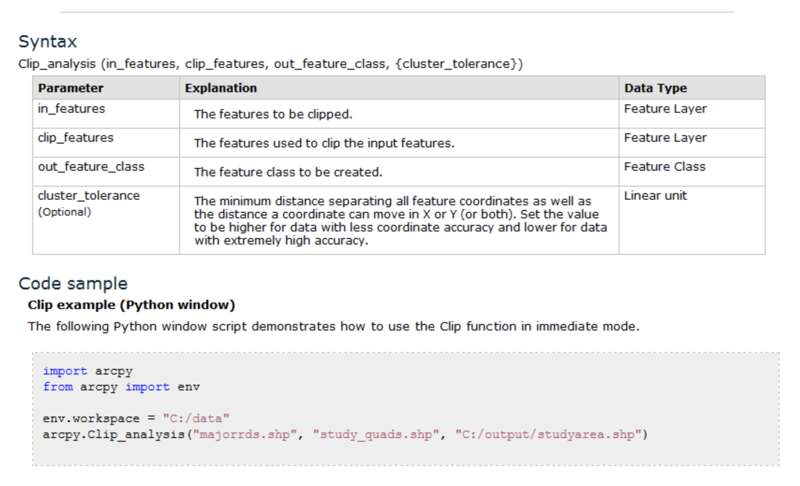

# Lekce 10: Spouštění nástrojů ArcGIS pomocí balíčku ArcPy

Tato lekce uvádí do balíčku `arcpy`, který zprostředkovává funkcionalitu programu ArcGIS pro použití v rámci jazyka Python. To - mimo mnoho dalších věcí - zahrnuje možnost spouštění jednotlivých nástrojů z ArcToolboxu přímo ze skriptu, aniž bychom museli program ArcGIS (např. ArcMap) vůbec spouštět (musí však být pochopitelně nainstalován). Balíček `arcpy`, stejně jako celý Python, je distribuován společně s programem ArcGIS. Je však třeba dát si pozor na správnou verzi: v řadě ArcGIS Desktop 10.X se stále používá Python 2.7 (a ten je i distribuován spolu s programem). Od verze ArcGIS Pro se naopak používá poslední řada Pythonu, tedy 3.X. Mít v počítači více verzí Pythonu a používat vždy tu, která je třeba, by však nemělo představovat žádný velký problém.

V této lekci budeme používat [data](https://owncloud.cesnet.cz/index.php/s/YlaMGKuRZ0NIb2e) z území Libereckého kraje.

## Spuštění nástroje a objekt *Result*

Prvním krokem ke zpřístupnění funkcionality ArcGIS do Pythonu je načtení modulu `arcpy`:

```python
import arcpy
```

Chceme-li následně spustit nějaký nástroj z ArcToolbox, např. *Clip*, je syntaxe většinou následující:

```python
arcpy.<Nazev_nastroje>_<alias_toolboxu>(<argumenty_nastroje>)
```

Alias příslušného toolboxu je důležité uvést, neboť v různých toolboxech mohou existovat nástroje stejného jména, které však dělají něco jiného (dobrým příkladem je právě nástroj *Clip*). Alias toolboxu můžeme snadno zjistit v jeho vlastnostech (pravý klik na toolbox v ArcMap a volba *Properties*). V případě nástroje *Clip* z nástrojové sady *Analysis Tools -> Extract* bude vypadat příkaz nějak takto:

```python
arcpy.Clip_analysis(r"C:\cesta\k\vrstve\co\chci\orezat.shp", r"C:\orezova\vrstva.shp", 
                    r"C:\cesta\kde\bude\ulozen\vysledek.shp")
```

Syntax jednotlivých nástrojů je vždy uveden na příslušné stránce nápovědy ArcGIS, kde je vždy uvedena sekce *Syntax* s vysvětlením všech parametrů a sekce *Code sample* s ukázkou použití. Používání nápovědy by se pro vás mělo stát běžnou záležitostí. V případě nástroje *Clip* vypadají příslušné sekce takto:



> **Úkol 1.** Použijte nástroj *Clip* (buď ve skriptu nebo na konzoli Python Shell) k nalezení části silniční sítě, jež se nachází v lesích.

Jak je vidět, nástroje z ArcToolboxu jsou v modulu `arcpy` implementovány ve formě funkcí. Jakou mají tyto funkce návratovou hodnotu? V drtivé většině případů (neplatí pro rastrové nástroje, jak bude osvětleno později) je návratovou hodnotou tzv. objekt třídy *Result*. Ten je možné při spuštění nástroje "zachytit" do proměnné a dále s ním pracovat:

```python
clip_result = arcpy.Clip_analysis(r"C:\cesta\k\vrstve\co\chci\orezat.shp", 
                                  r"C:\orezova\vrstva.shp", 
                                  r"C:\cesta\kde\bude\ulozen\vysledek.shp")
```

Objekt *Result* reprezentuje záznam o průběhu výpočtu daného nástroje, odpovídající tomu, co znáte z okna *Results* v ArcMap. Co vlastně tento objekt (resp. příslušná třída) všechno obsahuje? Nejlepší odpověď nám opět dá nápověda. V systému nápovědy ArcGIS vyhledejte sekci *Analyze -> ArcPy -> ArcPy Classes -> General -> Result*:


V nápovědě k této třídě vidíme následující sekce: *Summary* (základní popis k čemu třída je), *Discussion* (další detailu), *Syntax* (popis, jak lze stejnojmennou funkcí - tzv. *konstruktorem* třídy - vytvořit konkrétní objekt této třídy; toto v případě objektů *Result* v praxi nebudeme potřebovat), *Properties* (seznam vlastností třídy - důlěžité!), *Methods Overview* (přehled metod třídy - důležité!), *Methods* (detaily jednotlivých metod - důležité!) a *Code sample* (ukázky kódu, jak se s třídou běžně zachází - užitečné!).

> **Úkol 2.** Prostudujte si nápovědu k třídě *Result* a snažte se porozumět alespoň některým jejím vlastnostem a metodám.

Demonstrovat obsah - adresu výstupu, messages...

Buffer...

Počet prvků GetCount...

## Python Window v ArcMap

Spusti Clip... provázanost s mapovým dokumentem...

## Nastavení prostředí

Třída env a co obsahuje...

> **Úkol X.** Pomocí modulu `arcpy` změňte pracovní adresář programu ArcGIS.

in_memory...

Další nastavení ... přepis vrstev...

Druhý způsob...

## Správa licencí

zapínání a vypínání licencí...


## Shrnutí

## Úlohy

1. MutliBuffer...