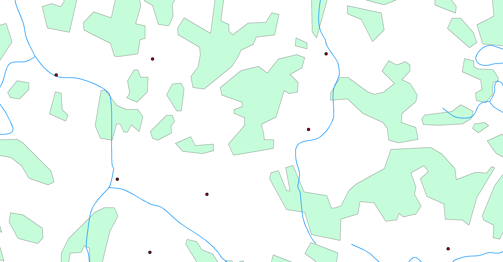
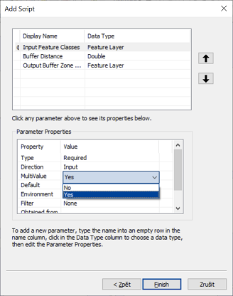

# Lekce 12: Uživatelská rozhraní nástrojů

V této kapitole si předvedeme, jak lze ke skriptu, využívajícímu nástroje ArcGIS, vytvořit uživatelské rozhraní tak, aby nástroj vypadal a choval se podobně jako ostatní vestavěné nástroje v ArcToolbox. Jde o podobnou věc, jakou již znáte z lekce 2, kde jste vytvářeli uživatelská rozhraní k modelům z Model Builderu.

## Jednoduché rozhraní

Tvorbu nástroje si předvedeme na jednoduchém příkladu nástroje *BatchClip*, který jste vytvářeli v lekci 10 (viz úlohu X). Příslušný skript může vypadat např. takto:

```python
import arcpy, os.path

# Vstupní parametry
input_folder = r"C:\cesta\ke\slozce\se\vstupnimi\daty"
clip_features = r"C:\cesta\k\polygonove\vrstve\kterou\se\bude\orezavat.shp"
output_folder = r"C:\cesta\ke\slozce\s\oriznutymi\vrstvami"

# Nastavení prostředí
arcpy.env.workspace = input_folder
arcpy.env.overwriteOutput = True

# Dávkové zpracování nástrojem Clip
shps = arcpy.ListFeatureClasses()
for shp in shps:
    output = os.path.join(output_folder, shp[:-4] + "_clipped.shp")
    arcpy.Clip_analysis(shp, clip_features, output)
```

> **Úkol 1.** Rozeberte si skript tak, aby vám byl jasný smysl každého řádku. Vyzkoušejte v praxi, že skript funguje.

Vytvořit ke skriptu uživatelské rozhraní znamená zajistit, aby vstupní parametry výpočtu (uvedeny schválně na začátku skriptu v samostatní sekci `Vstupní parametry`) mohl před spuštěním zadávat uživatel v nějakém přívětivém grafickém rozhraní. Jeho tvorba má dvě části: (1) příprava samotného grafického rozhraní a (2) úprava skriptu tak, aby s tímto rozhraním komunikoval.

Tvorba grafického rozhraní začíná v okně *Catalog* programu *ArcMap*. Nástroj - podobně jako v případě Model Builderu - musí existovat v nějakém toolboxu. Pokud tedy žádný připravený nemáte, je třeba jej nyní vytvořit:


(Pochopitelně, v jednom toolboxu můžeme mít uloženo více nástrojů.)

Po vytvoření toolboxu do něj přidáme nový nástroj pomocí kliknutí na něj pravým tlačítkem myši a volbou *Add -> Script*:


Tím se otevře dialogové okno *Add Script*, které nás provede tvorbou grafického rozhraní. Na první stránce je třeba zadat název (*Name*) a popisek (*Label*) nástroje. Zatímco název by neměl obsahovat diakritiku a mezery, popisek bude tím, pod čím se bude nástroj zobrazovat v toolboxu (může tedy obsahovat mezery a diakritiku). V parametru *Description* je možné zadat stručný popis fungování nástroje, který se bude zobrazovat v okně nástroje. Parametr *Stylesheet* umožňuje vybrat jiný než výchozí styl rozhraní, včetně vlastních uživatelsky definovaných stylů. Vlastní styly zde nebudeme řešit, použijeme výchozí styl (tj. ponechte políčko nevyplněné). Poslední dva parametry, zaškrtávací políčka *Store relative pathnames* a *Always run in foreground*, je dobré obě zaškrtnout. To první způsobí, že cesta ke skriptu (kterou budeme zadávat hned v dalším kroku) bude brána relativně k poloze toolboxu. To usnadní případnou distribuci nástroje na jiné počítače. Druhá možnost zase zajišťuje, že nástroj vždy poběží na popředí (nikoli na pozadí), což je obecně bezpečnější a stabilnější možnost.


Po kliknutí na *Další* se v dalším okně zadává cesta k samotnému skriptu. Je dobrou praxí mít skript uložený ve stejné složce, ve které máme uložen i toolbox.


Následuje stránka se zadáváním parametrů nástroje. V horní části je tabulka s parametry, v dolní části jsou vlastnosti daného označeného parametru. Začněte psát do levého sloupce tabulky název parametru. Následně v pravém sloupci vyberte jeho typ. Prvním parametrem bude "Input Workspace", tedy složka se vstupními vrstvami. Typ tohoto parametru může být buď *Folder* nebo *Workspace*. Pokud zvolíme první možnost, bude nástroj schopen pracovat pouze v klasické složce se shapefily. Druhá možnost, *Workspace*, je obecnější a zahrnuje vedle klasické složky i geodatabázi, takže nástroj bude schopen oříznout všechny vektorové vrstvy v nějaké geodatabázi či její datové sadě (*Feature Dataset*). Je tedy výhodnější zvolit tuto druhou možnost. U tohoto parametru jsou všechny výchozí hodnoty vlastností (v dolní části okna) vyhovující (projděte si je a zkusit usoudit, jaký mají jednotlivé vlastnosti význam).


Dalším parametrem bude ořezová vrstva ("Clip Features"). Jejím typem by mohl být *Shapefile*, *Feature Class* nebo *Feature Layer*. Druhá možnost je oproti první opět obecnější a umožňuje pracovat nejen s shapefily, ale i s vrstvami v geodatabázi. Třetí možnost je nicméně nejlepší, neboť vedle uvedených možností umožňuje i práci s vrstvami v ArcMap. Pokud jí tedy zvolíme (a my ji zvolíme), bude se v nástroji do příslušného parametru automaticky nabízet seznam aktuálně načtených vrstev z mapového dokumentu.

K parametru *Clip Features* je také vhodné nastavit tzv. *Filtr*, který neumožní uživateli zadat jiný geometrický typ než polygon. Příslušné nastavení se provede ve vlastnostech parametru, vlastnost *Filter*. 


Po klinutí na *Feature Class* se otevře okno se zaškrtávacími políčky, kde je třeba ponechat zaškrtnutou pouze možnost "Polygon":


Posledním parametrem bude *Output Workspace*, tj. složka (či geodatabáze), kam se budou ukládat výstupní vrstvy. Opět půjde o typ *Workspace* s výchozími nastaveními vlastností. Nyní máme parametry nastaveny a můžeme kliknout na *Finish*. Po otevření nástroje z *Catalogu* vidíme připravené uživatelské rozhraní:


Zbývá zařídit, aby se hodnoty parametrů zadané uživatelem v grafickém rozhraní předaly do skriptu pro výpočet. K tomu je slouží funkce `GetParameterAsText` z balíčku `arcpy`. Při spuštění nástroje tato funkce přečte hodnotu z uživatelského rozhraní a vrátí jí v podobě textového řetězce. (*Poznámka: V našem případě jsou všechny parametry textové - viz skript na začátku lekce - proto jejich předání ve formě textu je to, co potřebujeme. Pokud bychom však chtěli např. zadávat v některých parametrech čísla či jiné datové typy, je nutné je po obdržení hodnoty parametru z funkce* `GetParamaterAsText` *zkonvertovat na příslušný datový typ.*)

Jediným argumentem funkce `GetParameterAsText` je index neboli pořadí parametru, který se má číst. Pořadí parametrů přitom odpovídá tomu, jak jsme je seřadili v grafickém rozhraní. Hlavička našeho skriptu proto bude vypadat nyní takto:

```python
import arcpy, os.path

# Vstupní parametry
input_folder = arcpy.GetParameterAsText(0)
clip_features = arcpy.GetParameterAsText(1)
output_folder = arcpy.GetParameterAsText(2)

# Nastavení prostředí
arcpy.env.workspace = input_folder
arcpy.env.overwriteOutput = True

# Dávkové zpracování nástrojem Clip
shps = arcpy.ListFeatureClasses()
for shp in shps:
    output = os.path.join(output_folder, shp[:-4] + "_clipped.shp")
    arcpy.Clip_analysis(shp, clip_features, output)
```

Nyní je nástroj připraven a můžeme jej spustit.

> **Úkol 2.** Popsaným způsobem vytvořte rozhraní k nástroji *BatchClip* a nástroj vyzkoušejte.

## Zprávy o průběhu výpočtu

Někdy je výhodné, pokud máme ve skriptu zakomponovány zprávy, jež se mají v určité fázi výpočtu vypisovat na výstup (např. na konzoli Python Shell). Je to výhodné zejména ve dvou případech:

- Pokud je výpočet dlouhý a zahrnuje řadu kroků, případně nějaký cyklus, je možné na začátku každého kroku či iterace cyklu nechat vypsat, co program zrovna dělá. Tak budeme mít přehled, v jaké fázi výpočtu zrovna jsme. Navíc pokud program v nějaké fázi selže a skončí chybovým hlášením, budeme vědět, v jaké fázi výpočtu to bylo a kde v kódu máme tedy hledat chybu.
- Druhou situací je, pokud náš program nefunguje správně a my nevíme, kde je chyba. Máme-li např. podezření, že v určité fázi nějaká proměnná neobsahuje hodnotu, kterou by měla, můžeme si nechat obsah této proměnné v dané fázi výpočtu vypsat. To nám může velmi pomoct při hledání, kde jsme udělali chybu.

V případě našeho jednoduchého nástroje *BatchClip* bychom mohli např. chtít, aby se v každém kole cyklu vypsala na výstup informace o tom, jakou vrstvu program zrovna zpracovává. Výpis na standardní výstup (např. konzoli Python Shell) se provede jednoduše pomocí funkce `print`:

```python
import arcpy, os.path, sys

# Vstupní parametry
input_folder = r"C:\cesta\ke\slozce\se\vstupnimi\daty"
clip_features = r"C:\cesta\k\polygonove\vrstve\kterou\se\bude\orezavat.shp"
output_folder = r"C:\cesta\ke\slozce\s\oriznutymi\vrstvami"

# Nastavení prostředí
arcpy.env.workspace = input_folder
arcpy.env.overwriteOutput = True

# Dávkové zpracování nástrojem Clip
shps = arcpy.ListFeatureClasses()
for shp in shps:
    
    print("Working on " + shp + "...")
    sys.__stdout__.flush()
    
    output = os.path.join(output_folder, shp[:-4] + "_clipped.shp")
    arcpy.Clip_analysis(shp, clip_features, output)
```

Podivný řádek `sys.__stdout__.flush()` zajišťuje, že se výpis provede opravdu ihned. Pokud jej neuvedeme, často se nic špatného nestane a výpisy budou fungovat jak mají. Někdy však dochází ke zpoždění výpisů, takže se veškeré výpočty nejprve provedou, a až pak se na konzoli vypíší všechna hlášení najednou. Tím ovšem průběžná hlášení přestávají být průběžná a ztrácí smysl. Objekt `__stdout__` z modulu `sys` (všimněte si, že tento modul musel být na začátku skriptu načten!) reprezentuje tzv. *standardní výstup*, kterým je v našem případě konzole Python Shell. Jeho metoda `flush` pak tzv. "vyleje" či "spláchne" vše, co čeká aktuálně ve frontě na vypsání.

Jak je možné podobné zprávy posílat do okna výpočtu nástroje v ArcMap? Zde již klasický `print` nefunguje, nicméně podobnou práci udělá funkce `AddMessage` balíčku `arcpy`. Skript nástroje tedy upravíme následovně:

```python
import arcpy, os.path

# Vstupní parametry
input_folder = arcpy.GetParameterAsText(0)
clip_features = arcpy.GetParameterAsText(1)
output_folder = arcpy.GetParameterAsText(2)

# Nastavení prostředí
arcpy.env.workspace = input_folder
arcpy.env.overwriteOutput = True

# Dávkové zpracování nástrojem Clip
shps = arcpy.ListFeatureClasses()
for shp in shps:
    
    arcpy.AddMessage("Working on " + shp + "...")
    
    output = os.path.join(output_folder, shp[:-4] + "_clipped.shp")
    arcpy.Clip_analysis(shp, clip_features, output)
```

Průběžný výpis při výpočtu nyní vypadá takto:


> **Úkol 3.** Doplňte do nástroje *BatchClip* běhové zprávy výše uvedeným způsobem a vyzkoušejte.

## Vícenásobné a výstupní parametry

Různých typů parametrů a jejich vlastností je velké množství. Některé z nich si ukážeme na příkladu dalšího nástroje, který má pro vstupní seznam vektorových vrstev udělat obalovanou zónu o zadaném poloměru. Obalové zóny vstupních vrstev by přitom měly být spojeny do jediné vrstvy, přičemž prostorově se nepřekrývající části by měly být v samostatných polygonech, naopak prostorově se překrývající části obalové zóny by měly být spojené do jediného polygonu.

Pokud bychom měli na vstupu bodovou, liniovou a polygonovou vrstvu jako na tomto obrázku:

 

měla by výstupní vrstva vypadat nějak takto:


Skript, který by tuto úlohu zpracovával, by mohl vypadat nějak takto:

```python
import arcpy

# Vstupní parametry
feature_list = [r"C:\vrstva1.shp", r"C:\vrstva2.shp", ...]
buffer_distance = 100
output_features = r"C:\vystupni_vrstva.shp"

# Nastavení environments
arcpy.env.workspace = "in_memory"
arcpy.env.overwriteOutput = True

# Obalové zóny
buffers = []
for fc in feature_list:
    b = arcpy.Buffer_analysis(fc, fc + "_buffer", buffer_distance)
    buffers.append(b)

# Spojení obalových zón
u = arcpy.Union_analysis(buffers, "union")
arcpy.Dissolve_management(u, output_features, "", "", "SINGLE_PART")
```

Všimněme si zde několika věcí:

- Pracovní adresář byl na začátku nastaven na `"in_memory"`. Díky tomu se veškeré průběžné výstupy (tj. všechny výstupy z nástroje *Buffer* a výstup z nástroje *Union*) budou dočasně ukládat do operační paměti a nikoli na pevný disk. Pouze konečný výstup z nástroje *Dissolve* se uloží do umístění specifikovaného v parametru `output_features`.
- Seznam `buffers`, do kterého se ukládají výsledky jednotlivých obalových zón, obsahuje objekty *Result*. Ty je však možné použít jako vstupy do dalších analýz.
- V nástroji *Union* se vícenásobný vstup (seznam vrstev, které se mají spojit) zadává jako pythonovský seznam (jaké jiné nástroje s vícenásobným vstupním parametrem znáte?).
- V nástroji *Dissolve* je parametr *multi_part* nastaven na hodnotu "SINGLE_PART" (viz nápovědu k tomuto nástroji!). Jelikož je tento parametr až pátý v řadě a předcházejí mu dva nepovinné parametry, u nichž chceme ponechat výchozí hodnoty, je na místě těchto parametrů prázdný řetězec. 

> **Úkol 4.** Vyzkoušejte uvedený skript na reálných datech.

Nyní k nástroji vytvoříme uživatelské rozhraní. Postupujeme stejně jako v předchozím případě: přidáme do našeho toolboxu nový skript a projedeme dialogové okno s názvem, umístěním skriptu a tabulkou parametrů. Ta bude vypadat nějak takto:


Nyní se zaměříme na vlastnosti jednotlivých parametrů. První parametr - *Input Feature Classes* - je sice typu *Feature Layer*, musíme nicméně zařídit, aby umožňoval zadání více vstupních vrstev. K tomu slouží vlastnost *MutliValue*, kterou je třeba nastavit na "Yes":



Parametr *Buffer Distance* je typu *Double*, parametr *Output Buffer Zone Features* je typu *Feature Layer*. U posledního parametru je třeba nastavit vlastnost *Direction* na "Output", neboť příslušná vrstva ve chvíli spouštění nástroje ještě neexistuje a bude teprve nástrojem vytvořena:


Uživatelské rozhraní nástroje nyní vypadá takto:


Nyní je ještě třeba upravit skript a pomocí funkce `GetParameterAsText` předat parametry do skriptu:

```python
import arcpy

# Vstupní parametry
feature_list = arcpy.GetParameterAsText(0).split(";")
buffer_distance = float(arcpy.GetParameterAsText(1))
output_features = arcpy.GetParameterAsText(2)

# Nastavení environments
arcpy.env.workspace = "in_memory"
arcpy.env.overwriteOutput = True

# Obalové zóny
buffers = []
for fc in feature_list:
    b = arcpy.Buffer_analysis(fc, fc + "_buffer", buffer_distance)
    buffers.append(b)

# Spojení obalových zón
u = arcpy.Union_analysis(buffers, "union")
arcpy.Dissolve_management(u, output_features, "", "", "SINGLE_PART")
```

Všimněme si dvou věcí:

- Do parametru `feature_list` předá funkce `GetParameterAsText` jednotlivé vstupní vrstvy jako jeden textový řetězec, ve kterém jsou adresy jednotlivých vstupních vrstev za sebou oddělené středníky. (To je díky tomu, že jsme v grafickém rozhraní u příslušného parametru nastavili jeho vlastnost *MultiValue* na "Yes".) Metoda `split(";")` zavolaná na tomto řetězci z něj vytvoří pythonovský seznam, který je možné následně v cyklu procházet a vytvářet obalové zóny. 
- U parametru *buffer_distance* je třeba hodnotu vrácenou funkcí `GetParameterAsText` převést na číselný typ funkcí `float`, jinak by se totiž jednalo o textový řetězec. (Ve skutečnosti by nástroj *Buffer* akceptoval i textový vstup, ale v řadě jiných případů je třeba textový výstup funkce `GetParameterAsText` převést na jiný datový typ.)

> **Úkol 5.** Vytvořte uvedený nástroj a vyzkoušejte jeho funkčnost.

*Poznámka na závěr:* Parametr *Buffer Distance* je typu *Double*, mohli bychom však s výhodou použít i typ *Linear unit*, který nabízí i volbu jednotek. V takovém případě ale nelze hodnotu parametru předanou funkcí `GetParameterAsText` převádět na číslo, neboť půjde o text typu `"100 Meters"`. Ten je však možné přímo použít jako vstup do nástroje *Buffer*. 

Rozhraní nástroje bude s parametrem typu *Linear unit* vypadat takto:


## Odvozené parametry

Převod vektorové vrstvy na rastr...

## Nápověda

## Závěrečné poznámky

## Shrnutí

## Úlohy

1. Vytvořte uživatelské rozhraní k nástroji MultiBuffer.