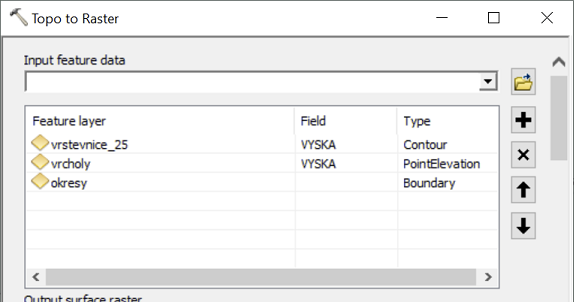
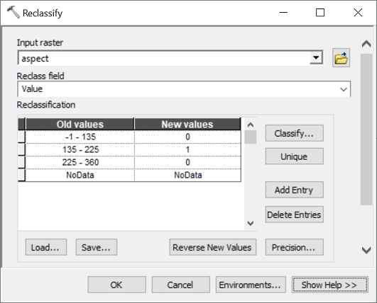

# Lekce 18: Rastrové analýzy

Budeme řešit následující úlohu:

> Jako vášnivý milovník vína toužíte po vlastní vinici. Nejprve je pro ni však třeba vybrat vhodné území, splňující následující kritéria: bude na svazích se sklonem menším než 20%, s jihovýchodní až jihozápadní orientací a zároveň skryta před zraky nenechavých turistů, kteří by ji mohli z okolních vyhlídek vidět a přijít na ochutnávku hroznů. Jakou rozlohu má vhodné území pro založení vinice?

(Samozřejmě pro reálnou analýzu bychom navíc uvažovali nadmořskou výšku (např. do 400 m n. m.) a půdní typ.)

K dispozici máme (data jsou ke stažení [zde](https://owncloud.cesnet.cz/index.php/s/1HMr6tOrOCYIPiq)):

- `vrstevnice_25.shp`: liniová vrstva vrstevnic s krokem 25 m.
- `vrcholy.shp`: bodová vrstva vrcholků kopců.
-  `okresy.shp`: polygonová vrstva okresů ČR.

Úlohu budeme řešit nejprve pro celou ČR, následně řešení upravíme tak, aby proběhlo postupně pro jednotlivé okresy ČR.

## Nastavení prostředí a parametrů

Prvním krokem bude načtení modulů, nastavení prostředí a definování proměnných se vstupními parametry výpočtu:

```python
import arcpy

# Vstupní vrstvy a další parametry
in_vrst = r"C:\cesta\k\souboru\vrstevnice_25.shp"
in_vrch = r"C:\cesta\k\souboru\vrcholy.shp"
in_okre = r"C:\cesta\k\souboru\okresy.shp"
vrst_field = "VYSKA" # Pole ve vrstvě vrstevnic, kde je nadmořská výška
vrch_field = "VYSKA" # Pole ve vrstvě vrcholů, kde je nadmořská výška
out_plochy = r"C:\cesta\kde\má\být\uložen\výsledek.tif"

# Nastavení prostředí
arcpy.env.workspace = r"in_memory"
arcpy.env.cellSize = 250
arcpy.env.overwriteOutput = True
arcpy.env.mask = in_okre
arcpy.CheckOutExtension("Spatial")
```

Příkaz `arcpy.CheckOutExtension('Spatial')` zajišťuje zpřístupnění licence extenze *Spatial Analyst*, kterou budeme pro výpočet potřebovat. Zapnutí extenze v ArcMap je součástí nastavení mapového dokumentu, proto při práci s extenzemi pomocí Pythonu je třeba toto nastavení vždy explicitně udělat. Výraz `CheckOut` může být matoucí - opravdu se jím extenze zapíná, a nikoli vypíná. Naopak příkazem `CheckInExtension` se extenze vypíná.

## Topo to Raster

Jelikož podmínky pro vinici zahrnují sklon, orientaci svahu a viditelnost, bude prvním krokem naší analýzy vytvoření digitálního modelu terénu. Protože informaci o terénu máme v podobě vrstevnic, nezbývá než použít nástroj *TopoToRaster*. Ten je z hlediska volání v Pythonu poněkud složitější (viz nápovědu!).

Jak víte, do nástroje *TopoToRaster* může vstupovat více různých vstupních vrstev, přičemž každá může být jiného typu. Základním vstupem je zpravidla vrstva vrstevnic (typ *Contour*), doplňkovými vstupy v našem případě budou vrstva vrcholů (typ *Point Elevation*) a vrstva okresů (typ *Boundary*). Odpovídá to následujícímu nastavení v okně nástroje:



Každému z typů vstupů odpovídá v balíčku `arcpy` samostatná třída, která tento typ vstupu reprezentuje. Pro typ *Contour* je zde třída `TopoContour`, pro typ *PointElevation* třída `TopoPointElevation` a pro typ *Boundary* třída `TopoBoundary` (obdobně i pro ostatní typy vstupů). To znamená, že každý ze vstupů je třeba reprezentovat objektem příslušné třídy. Tyto třídy, stejně jako samotný nástroj *TopoToRaster*, jsou přitom přístupné přes modul `sa` ("Spatial Analyst"). Vytvoření jednotlivých vstupů bude tedy vypadat následovně:

```python
inContours = arcpy.sa.TopoContour([[in_vrst, vrst_field]])
inPoints = arcpy.sa.TopoPointElevation([[in_vrch, vrch_field]])
inBoundary = arcpy.sa.TopoBoundary([in_okre])
```

U vrstevnic a vrcholů se vstup zadává jako seznam seznamů: vnější seznam je zde proto, že vrstev s vrstevnicemi (či vrcholy) může být teoreticky více, přičemž všechny se společně zadávají do jediného objektu `TopoContour`. Vnitřní seznam je zde proto, že ke každé vrstvě vrstevnic či vrcholů je třeba připojit informaci, ve kterém poli jsou hodnoty nadmořské výšky. Vstup *Boundary* se zadává jako jednoduchý seznam, neboť i vrstev s hranicemi zájmového území by teoreticky mohlo být více.

Z jednotlivých objektů `Topo*` se následně vytvoří seznam, a ten se předá jako vstup do nástroje *TopoToRaster*:

```python
dtm = arcpy.sa.TopoToRaster([inContours, inPoints, inBoundary], enforce = "NO_ENFORCE")
```

Zde je třeba upozornit na základní rozdíl mezi tím, jak v Pythonu funguje většina nástrojů z ArcToolboxu a jak fungují rastrové nástroje z extenze Spatial Analyst. Zatímco návratovou hodnotou většiny ostatních nástrojů je objekt třídy *Result*, u nástrojů, jejichž výstupem je rastr, je návratovou hodnotou objekt třídy `Raster`, což je přímo výstupní rastr, nicméně pouze jako vrstva v operační paměti. Výstup se tedy nezapisuje automaticky na disk, a chceme-li jej uchovat (tj. uložit na disk), je třeba tak učinit explicitně v samostatném kroku pomocí metody `save`, kterou třída `Raster` disponuje:

```python
dtm.save("C\:cesta\kde\má\být\uložen\rastr\dtm.tif")
```

Toto chování je ve skutečnosti velmi výhodné: umožňuje nám vykonat při výpočtu celou řadu mezikroků, jejichž výstupy není třeba ukládat na disk. Tam nakonec uložíme až finální výsledek analýzy.

## Slope a Aspect

Dalším krokem analýzy je výpočet sklonu nástrojem *Slope* (opět bude výstupem pouze vrstva třídy `Raster` neuložená na disk):

```python
slp = arcpy.sa.Slope(dtm, "PERCENT_RISE")
```

Podobným způsobem vypočítáme aspekt:

```python
aspect = arcpy.sa.Aspect(dtm)
```

Pokud bychom chtěli některý z rastrů uložit na disk (což nyní nepotřebujeme), můžeme opět použít metodu `save`:

```python
slp.save("path\to\slope.tif")
aspect.save("path\to\aspect.tif")
```

## Lokální mapová algebra

Podmínka týkající se vyhovujícího sklonu říká, že by měl být menší než 20%. K tomu můžeme buď použít nástroj *LessThan*:

```python
slp_ok = arcpy.sa.LessThan(slp, 20)
```

mnohem elegantnější a jednodušší je však využít toho, že modul `sa` definuje pro standardní matematické operátory speciální význam při použití na objekty `Raster`. Díky tomu můžeme s rastry provádět výpočty na způsob, jaký dobře znáte z *RasterCalculatoru*:

```python
slp_ok = slp < 20
```

Výsledkem je opět vrstva třídy `Raster`, kterou je v případě potřeby metodou `save` možné uložit na disk jako rastr v požadovaném formátu.

V případě aspektu máme najít místa, kde je orientace svahu zhruba jižní, tj. mezi jihovýchodem (azimut 135°) a jihozápadem (azimut 225°). Jednou možností by bylo využít matematických a logických operátorů a složit výslednou podmínku průnikem dílčích podmínek: vyhovující aspekt je větší než 135 *a zároveň* menší než 225:

```python
aspect_ok = (aspect > 135) & (aspect < 225)
```

## Reklasifikace

Jinou možností, jak najít místa s vyhovujícím aspektem, je reklasifikace. Jak známo, základem reklasifikace je tzv. reklasifikační tabulka, což je tabulka o dvou sloupcích, kde levý sloupec definuje původní hodnoty či jejich rozsah, pravý sloupec definuje odpovídající hodnoty v novém, reklasifikovaném rastru. V naší úloze by reklasifikační tabulka vypadala nějak takto:



(Připomeňme, že zahrnutí hodnoty -1 je proto, že touto hodnotou jsou v rastru aspektu kódována plochá území.)

Podobně jako u nástroje *TopoToRaster*, i do nástroje *Reclassify* se vstupní reklasifikační tabulka zadává pomocí objektu speciální třídy. Pokud jsou v levém sloupci tabulky jednotlivé hodnoty, použije se objekt třídy `RemapValue`. Pokud jsou "staré" hodnoty definovány rozsahem hodnot (jako v našem případě), použije se objekt třídy `RemapRange`, a to následujícím způsobem:

```python
reclass_table = arcpy.sa.RemapRange([[-1, 135, 0], [135, 225, 1], [225, 360, 0]])
```

Vidíme, že reklasifikační tabulka je do tohoto objektu poslána ve formě seznamu seznamů, kdy vnější seznam je seznamem řádků, vnitřní seznamy reprezentují jednotlivé řádky tabulky. První a druhá hodnota těchto seznamů reprezentují meze daného rozsahu ("Old values"), třetí hodnota reprezentuje novou hodnotu ("New values").

Takto vytvořenou reklasifikační tabulku je možné použít jako vstup do nástroje *Reclassify*:

```python
aspect_ok = arcpy.sa.Reclassify(aspect, "Value", reclass_table)
```

## Analýza viditelnosti

Dalším krokem je zjistit, která místa *nejsou* vidět ani z jednoho z vrcholů. Použijeme nástroj *Visibility* (mohli bychom však stejně dobře použít i starší nástroj *Viewshed*, který provádí stejný výpočet, jen mí trochu jiné rozhraní). Jak snadno zjistíme v nápovědě, nástroj *Visibility* má velké množství parametrů. Z nich budeme chtít většinu ponechat ve výchozím nastavení. Budeme však potřebovat nastavit parametr *Observation offset*, neboť je třeba uvažovat výšku pozorovatele, stojícího vždy na daném vrcholu (uvažujme např. výšku 1,7 m). Jelikož je parametr *Observation offset* až jedenáctým parametrem v pořadí, je možné nepovinné parametry umístěné před ním, u nichž chceme ponechat výchozí hodnoty, nahradit prázdnými řetězci (prozkoumejte ostatní parametry v nápovědě k nástroji!):

```python
visibility = arcpy.sa.Visibility(dtm, in_vrch, "", "", "", "", "", "", "", "", 1.7)
```

Jelikož jsme typ analýzy ponechali ve výchozím nastavení jako "FREQUENCY", je výsledkem analýzy viditelnosti rastr, kde je v každé buňce informace o počtu viditelných vrcholů (resp. počtu vrcholů, z nichž je daná buňka vidět). Kdybychom typ analýzy změnily na "OBSERVERS", pak by se ve výsledku daly odlišit jednotlivé vrcholy od sebe.

Jelikož my chceme zjistit, které buňky *nejsou* vidět zni z jednoho vrcholu, potřebujeme změnit hodnoty 0 (není vidět ani z jednoho vrcholu) na 1 a ostatní hodnoty na 0. To lze buď reklasifikací, 

```python
reclass_table = arcpy.sa.RemapRange([[0,0,1], [1,1000,0]])
visibility_ok = arcpy.sa.Reclassify(visibility, "Value", reclass_table)
```

nebo pomocí nástroje *Equal To*,

```python
visibility_ok = arcpy.sa.EqualTo(visibility, 0)
```

nebo pomocí operátoru `==`:

```python
visibility_ok = visbility == 0
```

Poslední způsob je zjevně nejjednodušší.

## Spojení podmínek

Výsledné spojení (průnik) podmínek je možné realizovat opakovaným použitím nástroje *Boolean And*:

```python
plochy_1 = arcpy.sa.BooleanAnd(slp_ok, aspect_ok)
plochy_ok = arcpy.sa.BooleanAnd(plochy_1, visibility_ok)
```

Nahradíme-li nástroj *Boolean And* operátorem `&`, je navíc možné oba kroky spojit do jednoho:

```python
plochy_ok = slp_ok & aspect_ok & visibility_ok
```

Pochopitelně stejného výsledku dosáhneme i pouhým vynásobením rastrů (kontrolní otázka: proč?):

```python
plochy_ok = slp_ok * aspect_ok * visibility_ok
```

Do jednoho kroku bychom případně mohli sloučit nejen toto finální spojení podmínek, ale i jednotlivé dílčí podmínky, asi takto:

```python
plochy_ok = (slp < 20) & (aspect > 135) & (aspect < 225) & (visibility == 0)
```

Celé řešení by tedy mohlo vypadat např. nějak takto (rozhodně to není jediná správná možnost!):

```python
import arcpy

# Vstupní vrstvy a další parametry
in_vrst = r"C:\cesta\k\souboru\vrstevnice_25.shp"
in_vrch = r"C:\cesta\k\souboru\vrcholy.shp"
in_okre = r"C:\cesta\k\souboru\okresy.shp"
vrst_field = "VYSKA" # Pole ve vrstvě vrstevnic, kde je nadmořská výška
vrch_field = "VYSKA" # Pole ve vrstvě vrcholů, kde je nadmořská výška

# Nastavení prostředí
arcpy.env.workspace = r"in_memory"
arcpy.env.cellSize = 250
arcpy.env.overwriteOutput = True
arcpy.env.mask = in_okre
arcpy.CheckOutExtension("Spatial")

# Tvorba DTM (Topo to Raster)
inContours = arcpy.sa.TopoContour([[in_vrst, vrst_field]])
inPoints = arcpy.sa.TopoPointElevation([[in_vrch, vrch_field]])
inBoundary = arcpy.sa.TopoBoundary([in_okre])
dtm = arcpy.sa.TopoToRaster([inContours, inPoints, inBoundary], enforce = "NO_ENFORCE")

# Sklon, aspekt a viditelnost
slp = arcpy.sa.Slope(dtm, "PERCENT_RISE")
aspect = arcpy.sa.Aspect(dtm)
visibility = arcpy.sa.Visibility(dtm, in_vrch, "", "", "", "", "", "", "", "", 1.7)

# Multikriteriální analýza
plochy_ok = (slp < 20) & (aspect > 135) & (aspect < 225) & (visibility == 0)

# Uložení výsledku
plochy_ok.save(out_plochy)
```

## Výpočet plochy

Zbývá ještě vypočítat plochu. K tomu můžeme použít údaj o počtu buněk s danou hodnotou, který najdeme v atributové tabulce výsledného rastru `plochy_ok`. Vyhovující plochy jsou kódované hodnotou `1`. Tabulku rastru můžeme standardním způsobem otevřít kurzorem, do něj však není možné dát jako vstup přímo objekt `Raster`. Můžeme však využít toho, že jsem výsledný rastr již uložili na disk, a otevřít tak kurzorem tento uložený rastr, jehož adresu máme v proměnné `out_plochy`:

```python
tab = arcpy.da.SearchCursor(out_plochy, ["Count"], '"Value" = 1')
```

Otevíráme pole `Count`, obsahující počty buněk pro jednotlivé hodnoty rastru. Zároveň otevíráme pouze řádek, odpovídající hodnotě 1, což je zajištěno SQL dotazem `"Value" = 1`. Otevíraná tabulka má tedy jen jeden řádek, na který se dostaneme metodu `next`:

```python
radek = tab.next()
```

Počet buněk s hodnotou 1 je tedy první položkou (otevíráme jen jeden sloupec: `Count`) tohoto řádku:

```python
pocet_bunek = radek[0]
```

Rozlohu vyhovujících ploch dostaneme vynásobením tohoto počtu buněk druhou mocninou velikosti buňky:

```python
cs = arcpy.env.cellSize
area = pocet_bunek*cs*cs
```

Zde předpokládáme, že velikost buňky nastavená v Environments odpovídá velikosti buňky našeho výstupního rastru. Alternativně bychom mohlo velikost buňky daného rastru zjistit pomocí funkce `Describe`:

```python
cs = arcpy.Describe(out_plochy).meanCellWidth
```

případně pomocí nástroje *GetRasterProperties* ze sady *Data Management Tools*:

```python
result = arcpy.GetRasterProperties_management(out_plochy, "CELLSIZEX")
cs = float(result.getOutput(0))
```

Ať již získáme hodnotu `cs` (cellsize) tak či tak, následný výpočet plochy můžeme stručně napsat na jeden řádek:

```python
area = arcpy.da.SearchCursor(out_plochy, ["Count"], '"Value = 1"').next()[0]*cs*cs
```

## Řešení zvlášť pro jednotlivé okresy

Nyní celé řešení upravíme tak, aby se výpočet provedl pro každý okres zvlášť. Principem řešení bude pochopitelně cyklus přes všechny okresy. Výstupem budou jednak jednotlivé vrstvy vyhovujících ploch (pojmenované názvy okresů), jednak souhrnná tabulka `csv` s názvy okresů a rozlohami vyhovujících ploch. 

Možných řešení je více, zde si ukážeme následující:

1. Kurzorem si otevřeme vrstvu okresů a budeme postupně `for` cyklem procházet jednotlivé okresy.
2. V každém kole cyklu si daný okres si uložíme jako samostatný shapefile (`"in_memory"`).
3. Nastavíme rozsah a masku dle tohoto okresu a celou analýzu provedeme tak, jak jsme ji řešili pro celou ČR.
4. Zjištěnou plochu uložíme společně s názvem okresu do výstupní tabulky.

Nejprve upravíme začátek skriptu tak, že adresu výstupního rastru nahradíme výstupní složkou a přidáme adresu výstupní tabulky. Dále také změníme velikost buňky, neboť nyní může v rámci každého okresu analýza proběhnout podrobněji. Dále vypustíme nastavení masky, neboť masku budeme nastavovat pro každý okres zvlášť.

```python
import arcpy

# Vstupní vrstvy a další parametry
in_vrst = r"C:\cesta\k\souboru\vrstevnice_25.shp"
in_vrch = r"C:\cesta\k\souboru\vrcholy.shp"
in_okre = r"C:\cesta\k\souboru\okresy.shp"
vrst_field = "VYSKA" # Pole ve vrstvě vrstevnic, kde je nadmořská výška
vrch_field = "VYSKA" # Pole ve vrstvě vrcholů, kde je nadmořská výška
out_folder = r"C:\cesta\k\výstupní\složce"
out_csv = r"C:\cesta\kde\má\být\uložena\výstupní\tabulka.csv"

# Nastavení prostředí
arcpy.env.workspace = r"in_memory"
arcpy.env.cellSize = 50
arcpy.env.overwriteOutput = True
arcpy.CheckOutExtension("Spatial")
```

Než začneme procházet v cyklu jednotlivé okresy, otevřeme si výstupní tabulky pro zápis a přidáme hlavičku:

```python
csv = open(out_csv, "w")
csv.write("OKRES;ROZLOHA_VINIC\n")
```

Nyní můžeme přistoupit k samotnému cyklu. Otevřeme si kurzorem okresy a zahájíme cyklus. Budeme přitom potřebovat jednak název okresu, jednak samotnou geometrii okresu, abychom ji použili jako masku:

```python
tab = arcpy.da.SearchCursor(in_okre, ["NAZOK", "SHAPE@"])
for r in tab:
```

Hned na začátku si v každém kole cyklu "vytáhneme" z řádku název zpracovávaného okresu a jeho geometrii (toto není nutné, jen pak bude další část přehlednější).

```python
tab = arcpy.da.SearchCursor(in_okre, ["NAZOK", "SHAPE@"])
for r in tab:
    nazev_okresu = r[0]
    okres = r[1]
```

Nyní okres využijeme k nastavení prostorového rozsahu (pochopitelně stále zůstáváme odsazeni na úroveň těla cyklu, tj. jednu úroveň za hlavičku `for` cyklu):

```python
    arcpy.env.extent = okres.extent
```

Jak vidíme, k tomuto nastavením můžeme použít přímo objekt třídy `Polygon` a jeho vlastnost `extent`, reprezentující jeden prvek vrstvy okresů. Podobně bychom mohli tento objekt použít i ve většině analýz. Bohužel nastavení masky takto provést nelze, stejně jako nelze použít objekt `Polygon` jako vstup `TopoBoundary` v nástroji *TopoToRaster*. Proto nám nezbyde, než polygon uložit jako samostatný shapefile. To lze např. takto:

```python
	okres_shp = arcpy.CopyFeatures_management([okres], "okres.shp")
```

případně složitěji:

```python
	okres_shp = arcpy.CreateFeatureclass_management(arcpy.env.workspace, 
                                                    "okres.shp", 
                                                    "POLYGON")
    arcpy.da.InsertCursor("okres.shp", ["SHAPE@"]).insertRow((okres,))
```

Masku nastavovat nemusíme, neboť oříznutí na daný okres vyřešíme v nástroji *TopoToRaster* pomocí vstupu typu `TopoBoundary`.

Dále můžeme do těla cyklu (s odpovídajícím odsazení) vložit celou analýzu tak, jak jsme ji vytvořili pro celou ČR, takže celý cyklus bude nyní vypadat nějak takto:

```python
for r in tab:

    nazev_okresu = r[0]
    okres = r[1]

    # Nastavení rozsahu
    arcpy.env.extent = okres.extent

    # Uložení okresu do nového shapefilu
    okres_shp = arcpy.CopyFeatures_management([okres], "okres.shp")
    
    # Tvorba DTM (Topo to Raster)
	dtm = arcpy.sa.TopoToRaster([arcpy.sa.TopoContour([[in_vrst, vrst_field]]), 
                                 arcpy.sa.TopoPointElevation([[in_vrch, vrch_field]]), 
                                 arcpy.sa.TopoBoundary([okres_shp])],
                                enforce = "NO_ENFORCE")

	# Sklon, aspekt a viditelnost
	slp = arcpy.sa.Slope(dtm, "PERCENT_RISE")
	aspect = arcpy.sa.Aspect(dtm)
	visibility = arcpy.sa.Visibility(dtm, in_vrch, "", "", "", "", "", "", "", "", 1.7)

	# Multikriteriální analýza
	plochy_ok = (slp < 20) & (aspect > 135) & (aspect < 225) & (visibility == 0)

	# Uložení výsledku
    out_name = os.path.join(out_folder, nazev_okresu + "_vinice.tif")
	plochy_ok.save(out_name)
    
    # Výpočet plochy
    cs = arcpy.env.cellSize
    area = arcpy.da.SearchCursor(out_name, ["Count"], '"Value = 1"').next()[0]*cs*cs
```

Oproti původnímu kódu jsme provedli následující úpravy:

- Trochu jinak jsme napsali vstupy do nástroje *TopoToRaster*: předtím jsme si jednotlivé vstupy vytvořili předem do zvláštních proměnných, nyní jsme je vytvořili přímo uvnitř volání nástroje. (Tato úprava nebyla nijak nutná, slouží jen k ukázce různých způsobů, jak danou věc zapsat.)
- Kdekoli jsme předtím používali proměnnou `in_okre`, nahradili jsme ji proměnnou`okres_shp`.
- Název výstupu jsme složili z názvu výstupní složky, názvu okresu a koncovky `"_vinice.tif"` pomocí funkce `os.path.join`. Pozor: na začátek skriptu je třeba přidat příkaz k načtení příslušného modulu!
- Název výstupního rastru (viz předchozí bod) uložený do proměnné `out_name` jsme použili při výpočtu plochy pomocí kurzoru.

Poslední věc, kterou je třeba v rámci cyklu udělat, je zapsat název okresu a rozlohu vyhovujících ploch do výstupní tabulky:

```python
	csv.write(nazev_okresu + ";" + str(area) + "\n")
```

Nakonec, na závěr celého skriptu (tj. až po skončení cyklu), je třeba zavřít otevřenou tabulku a kurzor:

```python
csv.close()
del(tab)
```

A to je vše. Přidáme-li ještě průběžné hlášení, jaký okres se zrovna zpracovává, bude skript vypadat takto:

```python
# -*- coding: cp1250 -*-
import arcpy, os.path, sys

# Vstupní vrstvy a další parametry
in_vrst = r"C:\cesta\k\souboru\vrstevnice_25.shp"
in_vrch = r"C:\cesta\k\souboru\vrcholy.shp"
in_okre = r"C:\cesta\k\souboru\okresy.shp"
vrst_field = "VYSKA" # Pole ve vrstvě vrstevnic, kde je nadmořská výška
vrch_field = "VYSKA" # Pole ve vrstvě vrcholů, kde je nadmořská výška
out_folder = r"C:\cesta\k\výstupní\složce"
out_csv = r"C:\cesta\kde\má\být\uložena\výstupní\tabulka.csv"

# Nastavení prostředí
arcpy.env.workspace = r"in_memory"
arcpy.env.cellSize = 50
arcpy.env.overwriteOutput = True
arcpy.CheckOutExtension("Spatial")

# Otevření výstupní tabulky pro zápis
csv = open(out_csv, "w")
csv.write("OKRES;ROZLOHA_VINIC\n")

# Otevření okresů kurzorem a zahájení cyklu
tab = arcpy.da.SearchCursor(in_okre, ["NAZOK", "SHAPE@"])
for r in tab:

    nazev_okresu = r[0]
    okres = r[1]
    
    print(u"Zpracovávám okres " + nazev_okresu + "...")
    sys.__stdout__.flush()

    # Nastavení rozsahu
    arcpy.env.extent = okres.extent

    # Uložení okresu do nového shapefilu
    okres_shp = arcpy.CopyFeatures_management([okres], "okres.shp")
    
    # Tvorba DTM (Topo to Raster)
	dtm = arcpy.sa.TopoToRaster([arcpy.sa.TopoContour([[in_vrst, vrst_field]]), 
                                 arcpy.sa.TopoPointElevation([[in_vrch, vrch_field]]), 
                                 arcpy.sa.TopoBoundary([okres_shp])],
                                enforce = "NO_ENFORCE")

	# Sklon, aspekt a viditelnost
	slp = arcpy.sa.Slope(dtm, "PERCENT_RISE")
	aspect = arcpy.sa.Aspect(dtm)
	visibility = arcpy.sa.Visibility(dtm, in_vrch, "", "", "", "", "", "", "", "", 1.7)

	# Multikriteriální analýza
	plochy_ok = (slp < 20) & (aspect > 135) & (aspect < 225) & (visibility == 0)

	# Uložení výsledku
    out_name = os.path.join(out_folder, nazev_okresu + "_vinice.tif")
	plochy_ok.save(out_name)
    
    # Výpočet plochy
    cs = arcpy.env.cellSize
    area = arcpy.da.SearchCursor(out_name, ["Count"], '"Value = 1"').next()[0]*cs*cs
    
    # Zápis plochy do tabulky
    csv.write(nazev_okresu + ";" + str(area) + "\n")
    
# Úklid
csv.close()
del(tab)
```

