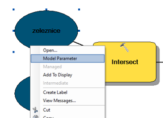
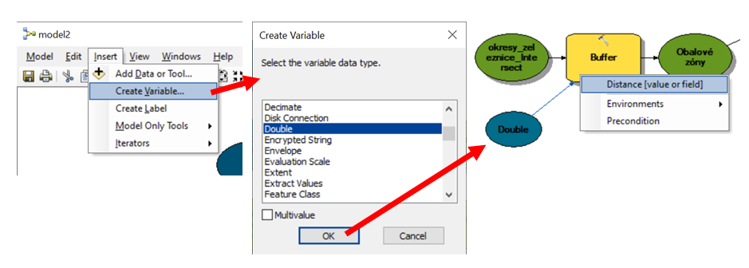
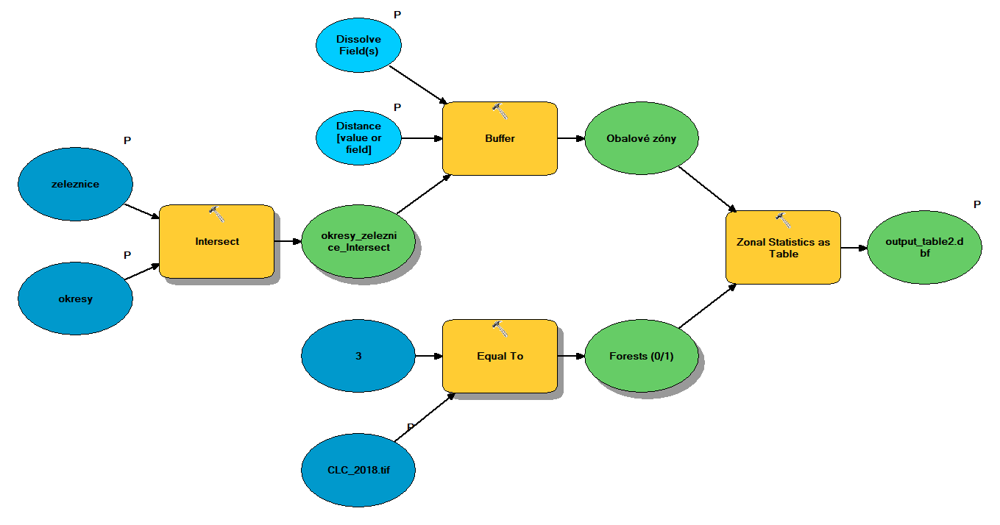
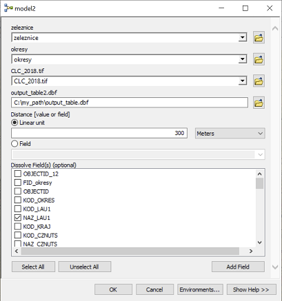
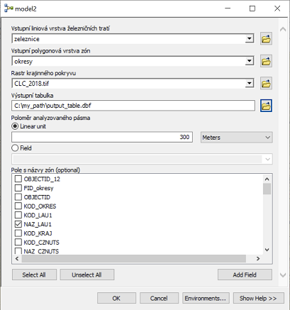
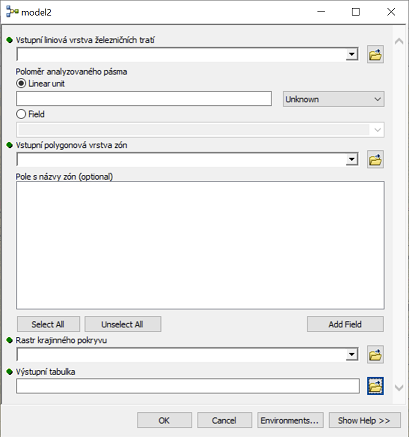
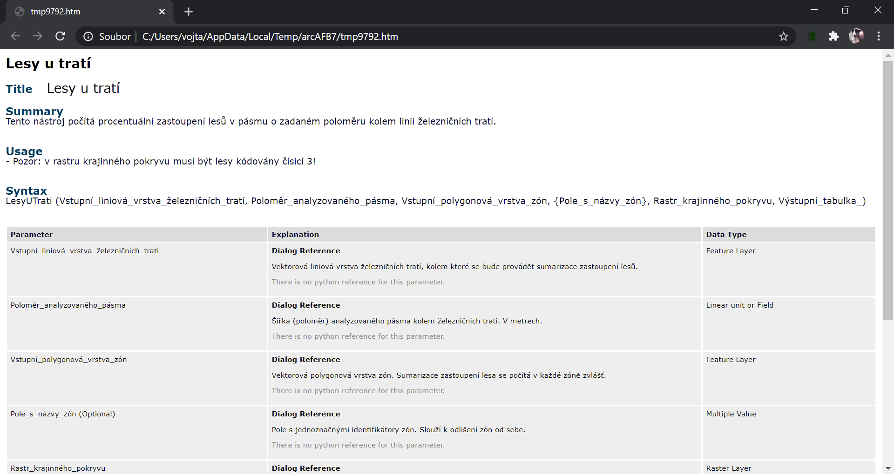
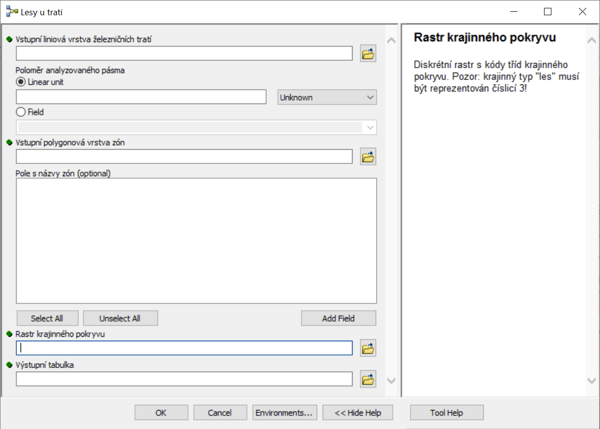
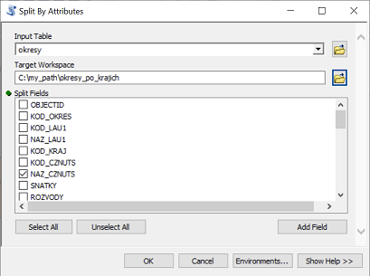
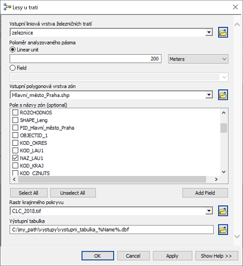

# Lekce 2: Uživatelské rozhraní k nástrojům z Model Builderu

*(c) Vojtěch Barták, FŽP ČZU Praha, 2020/2021*

V této lekci navážeme na lekci 1 a vytvoříme k modelu uživatelské rozhraní. Z modelu tak vznikne nástroj podobný vestavěným nástrojům ArcGIS. Při opakovaném spouštění nástroje lze měnit vstupní a výstupní vrstvy, stejně jako hodnoty dalších, námi definovaných parametrů. Nástroj s definovaným rozhraním lze navíc používat v dalších modelech i ve skriptech v Pythonu.

[TOC]

## Výchozí model

Výchozím modelem pro tuto lekci bude model vytvořený v lekci 1 v rámci řešení B. Tento model počítá relativní zastoupení lesů v pásu širokém 300 m kolem železnic.

Doposud jsme byli zvyklí s modelem pracovat v režimu editace (pravý klik na model v Catalogu a volba *Edit*) a spouštět jej pomocí Model -> Run Entire Model. Model má však předpřipravené uživatelské rozhraní, podobné tomu, jaké mají vestavěné nástroje v ArcToolbox. Okno našeho modelu-nástroje otevřeme dvojklikem na model v Catalogu (případně pravý klik na model a volba *Open*).

Zatím toho okno nástroje příliš nenabízí: jak sděluje hláška uprostřed, nemá totiž definované žádné parametry, pomocí nichž by uživatel mohl kontrolovat běh výpočtu. Po kliknutí na OK se model spustí s tím nastavením, jak jsme je definovali při editaci modelu (neváhejte vyzkoušet).

Nyní nastavíme modelu parametry tak, aby uživatelské rozhraní dávalo trochu větší smysl.

## Definice parametrů nástroje

Nastavení parametrů se provádí při editaci modelu (tedy ještě jednou: pravý klik na model v Catalogu a volba *Edit*). Parametrem se rozumí cokoli, co chceme nechat uživatele nastavit před spuštěním nástroje. Přinejmenším by to tedy měla být vstupní a výstupní data. 

Z dané položky modelu se stane parametr, když na ní klikneme pravým tlačítkem a myši a zaškrtneme volbu Model Parameter.

U příslušné položky se následně v pravém horním rohu objeví písmeno "P" na znamení, že se jedná o parametr modelu. 

Pokud tímto způsobem nastavíme jako parametry všechny vstupní vrstvy (zeleznice, okresy a rastr CLC_2018.tif) a výstupní tabulku (output_table.dbf), model uložíme a následně otevřeme okno nástroje, bude nyní vypadat takto:

Uživatel má nyní možnost před spuštěním nástroje změnit vstupní vrstvy a rozhodnout, jak se má jmenovat a kam má být uložena výstupní tabulka.

Jaké další parametry by mohl uživatel chtít měnit? Například by mohl určovat, v jak širokém okolí železnic chce analýzu provést. Nyní je okolí nastaveno pevně na 300 m, ale je docela představitelné, že bude pro nějakou aplikaci žádoucí tuto hodnotu změnit. 

V modelu položka s hodnotou 300 přímo nevystupuje, tato hodnota je "ukryta" v nastavení nástroje Buffer. Jak z ní tedy udělat parametr? Máme dvě možnosti:

1. Můžeme přidat do modelu novou proměnnou typu číslo a propojit ji s nástrojem Buffer, tj. udělat z ní vstup do tohoto nástroje: 

   

   Z nové proměnné pak uděláme parametr standardním postupem (pravý klik na ní a *Model Parameter*).

2. Můžeme parametr *Distance [value or field]* nástroje Buffer přímo udělat parametrem modelu. Stačí pravý klik na nástroj Buffer a volba *Make Variable -> From Parameter -> Distance [value or field]*. Vzniklou proměnnou pak nastavíme jako parametr.

   

V těchto dvou variantách je jeden drobný rozdíl: zatímco v prvním případě byla vzniklá proměnná (a tím i příslušný parametr) typu číslo, ve druhém případě je tato proměnná typu *Distance [value or field]*. Uživatel pak může namísto pevně daného poloměru obalové zóny určit pole v atributové tabulce vstupní vrstvy, ve kterém jsou poloměry obalových zón specifikovány. Mohli bychom tak např. nastavit každému okresu či kategorii tratě jinou šířku obalové zóny. Volte vždy podle toho, co chcete, aby váš nástroj uživateli nabízel.

Měl by být v modelu ještě nějaký parametr? Parametrů lze vytvářet téměř nekonečné množství, vždy však chceme, aby uživatelské prostředí nebylo přeplácané a neobsahovalo nedůležité položky. V našem nástroji stojí za úvahu ještě jeden parametr: při tvorbě modelu bylo v nástroji Buffer důležité správně nastavit *Dissolve Type* a *Dissolve Fields*, aby výsledná tabulka obsahovala sumární hodnoty pro jednotlivé okresy. Přitom pole s názvy okresů se nemusí pokaždé, kdy uživatel nástroj bude spouštět, jmenovat stejně. Koneckonců uživatel může analýzu provádět i pro jiné územní celky než pro okresy (např. kraje). Bude tedy vhodné nastavit parametr *Dissolve Fields* nástroje Buffer jako parametr modelu, a to stejným způsobem, jakým jsme to udělali s parametrem *Distance [value or field]*.

Výsledný model by měl vypadat následovně (všimněte si označení parametrů písmenem "P"):

Okno nástroje nyní vypadá takto (pozor: model je třeba uložit):

## Nastavení názvů, pořadí a výchozích hodnot parametrů

Uživatelské rozhraní, jak jsme ho nastavili, umožňuje sice uživateli měnit hodnoty parametrů, nevypadá ale moc pěkně. Pokud uživatel není dobře seznámen s tím, co má nástroj dělat a jaké parametry mají jaký význam, patrně z našeho uživatelského rozhraní nebude příliš moudrý. Abychom to zlepšili, je třeba:

- dát parametrům rozumné názvy,
- upravit vhodně pořadí parametrů,
- nastavit parametrům očekávatelné výchozí hodnoty,
- zdokumentovat chování nástroje pomocí nápovědy.

V této části probereme, jak na první tři kroky, v následující části se budeme věnovat nápovědě.

Názvy parametrů jsou dány názvy jednotlivých proměnných v modelu. Název proměnné (rozumněj: oválu v grafickém schematu modelu) je nejprve automaticky vygenerován (např. proměnná reprezentující vstupní data, která jsme do modelu myší přetáhli, se pojmenuje stejně, jako se jmenuje příslušná vrstva), lze jej však změnit. Stačí kliknout pravým tlačítkem myši na proměnnou a zvolit *Rename*.

Když takto přejmenujeme všechny parametry modelu, dostane naše uživatelské rozhraní trochu jasnější podobu:

Dalším krokem je úprava pořadí parametrů. Současné pořadí je do značné míry dílem náhody: parametry jsou v tom pořadí, v jakém jsme je při editaci modelu vytvářeli. Změnit pořadí parametrů je možné ve vlastnostech modelu, které jsou dostupné buď přes pravý klik na model v Catalogu -> *Properties*, nebo z editace modelu přes *Model -> Model Properties*. Na kartě vlastností přejdeme na záložku *Parameters*, kde je možné pořadí parametrů upravit pomocí šipek.

Po rozumné úpravě pořadí parametrů by mohl nástroj vypadat nějak takto:

Další věcí, kterou je možné změnit, jsou výchozí hodnoty parametrů. Jsou to ty hodnoty, které se automaticky předvyplní do políček pro jednotlivé parametry. Výchozí hodnoty jsou dány tím, jak jsme model vytvářeli. Změnit je můžeme jednoduše dvojklikem na jednotlivé položky modelu (při editaci) a změnou hodnoty.

Pro nástroje, které chceme opakovaně spouštět s určitým daným nastavením parametrů, je vhodné tyto hodnoty nastavit jako výchozí. Pokud však chceme vytvořit co nejuniverzálnější nástroj, bývá zvykem žádné výchozí hodnoty nenastavovat. Toho jednoduše docílíme vymazáním hodnot u jednotlivých proměnných-parametrů (drobnou cenou za to je, že model nebude v editačním režimu vybarvený, tj. připravený ke spuštění).

Nyní bude uživatel donucen specifikovat hodnoty všech parametrů dle vlastního uvážení.

Náš nástroj se nyní tváří výrazně obecněji, než na začátku. Zkuste si je např. spustit ne pro okresy, ale pro kraje, s šířkou analyzovaného pásma 500 m, resp. s různou šířkou pro různé kategorie tratí. (Vrstvu krajů můžete získat např. z databáze [ArcData 500](https://www.arcdata.cz/produkty/geograficka-data/arccr-500), musíte ji však převést do souřadnicového systému ETRS 1989 LAEA, nebo si ji již transformovanou můžete stáhnout [zde]()).

## Nápověda

Nejprve ještě změníme název nástroje: na záložce *General* vlastností modelu vyplníme políčka *Name* (skutečný název nástroje používaný např. při volání nástroje v Pythonu) a *Label* (název, pod jakým se nástroj zobrazuje v toolboxu).

Nápovědu k nástroji je možné vytvářet ve formátu HTML pomocí formuláře, který otevřeme přes pravý klik na nástroj v Catalogu a volbu *Item Description*. V něm po kliknutí na *Edit* jednoduše vyplníme položky, které chceme dokumentovat. 

Hotovou nápovědu můžeme otevřít (např. ve webovém prohlížeči) přes pravý klik na model v Catalogu a volbu *Help*. 

Nápověda jednotlivých položek se však rovněž zobrazuje přímo v okně nástroje, klikneme-li na tlačítko *Show Help*:

## Vnoření modelu do jiného modelu

Má-li model definované uživatelské rozhraní v podobě nastavitelných parametrů pro vstupy a výstupy do výpočtu, je možné jej použít podobným způsobem, jako jakýkoli jiný nástroj v ArcToolbox:

1. lze jej spouštět pomocí okna nástroje,
2. lze jej vkládat do jiných modelů,
3. lze jej volat v Pythonu.

První možnost již známe. Nyní si ukážeme druhou možnost, vnoření modelu do jiného modelu. Třetí možnost bude tématem dalších cvičení.

Vnoření modelu do jiného modelu si ukážeme na příkladu, kdy chceme náš nový nástroj použít v cyklu, např. postupně pro všechny datové sady z nějaké složky. Budeme řešit situaci, kdy nemáme jednotlivé okresy v jedné vrstvě, ale v samostatných shapefilech pro jednotlivé kraje uložených ve společné složce. Namísto vkládání iterátoru přímo do již vytvořeného nástroje, což by vyžadovalo jeho značnou úpravu včetně úpravy uživatelského rozhraní (viz [úloha 2](#Úlohy) na konci cvičení), vytvoříme nový model (nástroj), do kterého vložíme iterátor a propojíme ho s naším již vytvořeným nástrojem.

Popsanou výchozí situaci si nejprve musíme vytvořit: tedy musíme rozdělit okresy do samostatných shapefilů pro jednotlivé kraje. K tomu nejlépe poslouží nástroj *Split By Attributes* ze sady *Analysis Tools -> Extract*. V nástroji je třeba zadat pole, které se použije pro rozdělení prvků do jednotlivých nových datových sad. Hodnoty tohoto pole se zároveň použijí k jejich pojmenování. V našem případě půjde o pole s názvy krajů, což je *NAZ_CZNUTS*.

> Možná jste si všimli odlišné ikony nástroje *Split By Attributes* v ArcToolbox. Tento nástroj je totiž vytvořený v Pythonu. Stejné ikony se budou zobrazovat i u nástrojů, které budete vytvářet v tomto kurzu.

 

V zadané složce (parametr *Target Workspace*) nalezneme jednotlivé shapefily okresů v krajích, pojmenované jménem kraje.

Nyní si v Model Builderu vytvoříme nový model a vložíme do něj náš nástroj a iterátor přes třídy prvků (*Insert -> Iterator -> Feature Classes*).

Nyní půjde o to, obě komponenty vhodně propojit. Dvojklikem na iterátor se dostaneme do jeho parametrů a nastavíme složku, jejíž obsah se má v cyklu procházet (parametr *Workspace or Feature Dataset*). 

Ostatní parametry jsou nepovinné a není třeba je nastavovat, nicméně pro jistotu si jejich význam vysvětlíme:

- *Wildcard* - jedná se o filtr, pomocí kterého můžeme procházet pouze třídy prvků, jejichž název má určitou specifikovanou strukturu (např. obsahuje určitý řetězec, začíná určitým písmenem apod.).
- *Feature Type* - opět filtr, pomocí kterého lze nastavit typ procházených tříd prvků. Např. lze procházení omezit pouze na polygony. V našem případě nemáme v procházené složce nic jiného než polygonové shapefily, proto tento filtr nepotřebujeme.
- *Recursive* - zaškrtnutím se budou procházet i podsložky dané procházené složky.

Iterátor má dva výstupy: třídu prvků, která se v dané iteraci prochází (v našem případě shapefile příslušného kraje) a název této třídy (název kraje). My budeme využívat pouze první výstup, tedy samotný shapefilu, neboť ten bude v každé iteraci vstupem do našeho nástroje *Lesy u tratí*. Propojíme tedy tento výstup iterátoru s nástrojem a nastavíme ho jako hodnotu parametru *Vstupní polygonová vrstva zón*.

> Toto propojení je umožněné právě tím, že jsme nástroji *Lesy u tratí* definovali uživatelské rozhraní.

Abychom mohli nástroj spustit, zbývá nastavit ostatní parametry nástroje *Lesy u tratí*. Nyní máme dvě možnosti: buď parametry nastavíme přímo v editačním režimu modelu, nebo z nich opět uděláme parametry tohoto nového nástroje, čímž mu definujeme uživatelské rozhraní (namísto vstupní vrstvy okresů bude mít parametr vstupní složky s kraji). Pro jednoduchost zvolíme první možnost.

> Pozor! Nezapomeňte na parametry, které jsou na první pohled skryté, jako např. definování poloměru analyzovaného pásma či pole s názvy zón. K nim se dostanete stejně jako k parametrům jakéhokoli jiného nástroje: dvojklikem na nástroj v modelu.

Vzhledem k tomu, že výstupem nebude jedna tabulka, ale tolik tabulek, kolik je krajů, je třeba zajistit, aby se každá pojmenovala jinak, nejlépe s použitím názvu daného kraje. Podobnou situaci jsme již řešili v minulém cvičení. Připomeňme, že název kraje je v každé iteraci výstupem z iterátoru v podobě proměnné *Name*. Na tuto proměnnou se pak můžeme odkázat při definování názvu výstupní tabulky pomocí znaku `%`, takže název může vypadat např. `vystupni_tabulka_%Name%.dbf`.

Výsledný model vypadá takto:

Nyní stačí model uložit, spustit pomocí *Model -> Run Entire Model* a ověřit, zda výstupy odpovídají očekávání.

> Možná si říkáte, že by přecijen bylo jednodušší do nástroje *Lesy u tratí* prostě přidat další iterátor, namísto vkládání celého nástroje do jiného modelu. Zde ovšem narazíte na jedno ze základních omezení Model Builderu: ten totiž nepodporuje více iterátorů v jednom modelu. Pokud tedy chcete iterovat v několika hierarchicky vnořených cyklech, je vnoření modelu do jiného modelu jediným řešením. Jak ovšem uvidíte, pokud stejný nástroj vytvoříte v Pythonu, na žádná podobná omezení nenarazíte.

## Shrnutí

V této lekci jste se naučili:

- Jak se vytváří uživatelské rozhraní nástroje z Model Builderu pomocí definování jeho parametrů.
- Jak se nastavují další vlastnosti parametrů tak, aby uživatelské rozhraní dobře vypadalo a usnadňovalo uživateli jeho použití.
- Jak se k nástroji vytvoří nápověda, a to jak v podobě samostatné html stránky, tak v podobě rychlé nápovědy v okně nástroje.
- Jak lze nástroj s vytvořeným uživatelským rozhraním nejen spouštět přes toto rozhraní, ale i použít v jiném modelu.
- Jak se používá iterátor přes třídy prvků a jak v modelu vyřešit použití více vzájemně vnořených iterátorů.

## Úlohy

1. Vytvořte uživatelské rozhraní k základní úloze z lekce 1, řešení A.
2. Vytvořte uživatelské rozhraní k základní úloze z lekce 1, řešení C.
3. Vytvořte uživatelská rozhraní k úlohám z lekce 1.
4. Vytvořte uživatelské rozhraní k posledně vytvořenému modelu v této lekci.